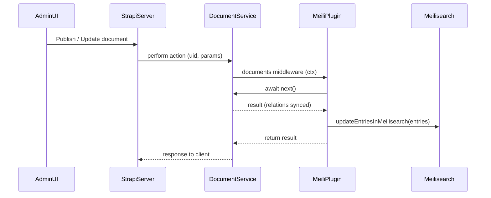

# Plan: Fix Meilisearch indexing with Strapi v5 Document Service

## Goals

- **Eliminate publish-time Internal Server Errors** on Strapi v5.11+ when Meilisearch indexing is enabled, especially for collections with many-to-many relations.
- **Migrate indexing triggers** from `strapi.db.lifecycles.subscribe` to **Document Service middleware** while preserving current behavior (only published entries, respect plugin config, custom indexes, i18n, etc.).
- **Keep compatibility with Strapi v5.6+** (per `peerDependencies`) and existing plugin APIs, minimizing breaking changes for users.

## High-level approach

- **Stop relying on database lifecycles** for Meilisearch indexing, as their timing is now too early relative to relation synchronization in Strapi v5.11+.
- **Register a single `strapi.documents.use` middleware** that runs after `await next()` to index or de-index documents using the existing Meilisearch services.
- **Use the existing store/listening mechanism** to restrict indexing to content types explicitly enabled in the plugin UI, preserving configuration and UX.
- **Update tests and docs** to reflect the new architecture and guard against regressions.

## Detailed steps

### 1. Understand and document current lifecycle-based integration

- **Map current flows**:
  - In `[server/src/bootstrap.js](server/src/bootstrap.js)`, `subscribeToLifecycles` calls `lifecycle.subscribeContentType` for each indexed content-type.
  - In `[server/src/services/lifecycle/lifecycle.js](server/src/services/lifecycle/lifecycle.js)`, `subscribeContentType` registers `strapi.db.lifecycles.subscribe` handlers (`afterCreate`, `afterCreateMany`, `afterUpdate`, `afterUpdateMany`, `afterDelete`, `afterDeleteMany`) and then records the content-type in the **listened content types** store.
  - Lifecycle handlers call into existing services: `contentType.getEntry/getEntries`, `meilisearch.addEntriesToMeilisearch`, `meilisearch.updateEntriesInMeilisearch`, `meilisearch.deleteEntriesFromMeiliSearch`.
- **Capture expected semantics** from tests in `[server/src/__tests__/lifecycle.test.js](server/src/__tests__/lifecycle.test.js)`:
  - Index only **published** entries (via config `removeUnpublishedArticles` in `[server/src/services/meilisearch/config.js](server/src/services/meilisearch/config.js)`).
  - Respect `entriesQuery` (locale, populate, fields) and plugin transformations/filters.
  - Maintain `listened` vs `indexed` store invariants.

### 2. Design the Document Service middleware

- **Middleware location & registration**:
  - Implement a reusable registration helper (e.g. `createDocumentMiddleware({ strapi })`) in a new module such as `[server/src/services/document-middleware/index.js](server/src/services/document-middleware/index.js)`.
  - Call this helper from the plugin server `register` (preferred) or `bootstrap` export in `[server/src/register.js](server/src/register.js)` or `[server/src/bootstrap.js](server/src/bootstrap.js)` using the `{ strapi }` argument.
  - Guard registration with feature detection: only call `strapi.documents.use` if it exists; otherwise (for safety) we can fall back to the existing lifecycle approach.
- **Scope of middleware**:
  - Middleware is global (`strapi.documents.use`) and will see **all** document operations for all content-types, including internal reads.
  - To keep behavior equivalent to per-content-type lifecycles, the middleware must:
    - Short-circuit if `ctx.uid` is **not** in the plugin's listened or indexed content types (from `store.getListenedContentTypes()` / `getIndexedContentTypes()`).
    - Ignore **read-only** actions (`findMany`, `findOne`, `count`, etc.) to avoid unnecessary work and recursion.

### 3. Implement middleware logic for indexing/de-indexing

- **Context contract**:
  - Use the Strapi v5 Document Service middleware signature: `strapi.documents.use(async (ctx, next) => { ... })`.
  - Call `const result = await next();` first so that all DB operations and relation synchronization complete.
  - After `next()`, `ctx` should contain at least `uid`, `action`, and parameters; `result` is the final document (or array / null depending on action).
- **Action routing**:
  - Define the list of **mutating actions** that should trigger Meilisearch synchronization (to be confirmed against Strapi docs during implementation):
    - Per-document: `create`, `update`, `delete`, `publish`, `unpublish`, `discardDraft`.
    - Bulk: `bulkCreate`, `bulkUpdate`, `bulkDelete`, `bulkPublish`, `bulkUnpublish`, etc.
  - For each relevant action:
    - Normalize to a list of entries (for bulk operations, `result` may be an array).
    - Extract an `entries` array where each element has at least an `id` and `publishedAt` when applicable.
- **Indexing strategy**:
  - Reuse existing Meilisearch connector behavior instead of re-implementing filters:
    - For **all** mutating actions (including `delete`-like), call `meilisearch.updateEntriesInMeilisearch({ contentType: ctx.uid, entries })`.
    - Rely on `sanitizeEntries` in `[server/src/services/meilisearch/connector.js](server/src/services/meilisearch/connector.js)` and `[server/src/services/meilisearch/config.js](server/src/services/meilisearch/config.js)` to:
      - Remove unpublished entries (`removeUnpublishedArticles` using `publishedAt`).
      - Enforce locale constraints, custom `filterEntry`, `transformEntry`, and `removeSensitiveFields` behavior.
    - Because `updateEntriesInMeilisearch` computes `deleteDocuments = entries - sanitizedEntries`, it already covers **de-indexing** for entries that become unpublished or otherwise filtered out.
  - Optionally, for explicit hard deletes (if Strapi does not return the deleted document), synthesize a minimal entry `{ id: documentId }` from `ctx.params` so `updateEntriesInMeilisearch` can enqueue delete tasks correctly.
- **Safety/robustness**:
  - Wrap Meilisearch calls in `try/catch` and log via `strapi.log.error` or `warn`, mirroring existing lifecycle handlers.
  - Ensure middleware always returns `result` so core behavior is unaffected even if indexing fails.

### 4. Decouple from database lifecycles while preserving store behavior

- **Adjust lifecycle service** in `[server/src/services/lifecycle/lifecycle.js](server/src/services/lifecycle/lifecycle.js)`:
  - Keep the **public API** (`subscribeContentType`) intact, but change its implementation:
    - When `strapi.documents?.use` exists (Strapi v5+), **do not call** `strapi.db.lifecycles.subscribe` at all.
    - Instead, only resolve the content-type UID and call `store.addListenedContentType({ contentType: contentTypeUid })`.
  - Optionally retain the old `strapi.db.lifecycles.subscribe` logic behind a guarded code path for environments without `strapi.documents.use`, if needed.
- **Bootstrap changes** in `[server/src/bootstrap.js](server/src/bootstrap.js)`:
  - Keep `syncIndexedCollections` unchanged so the store and indexes remain coherent.
  - Continue to call `subscribeToLifecycles` but rely on the updated `lifecycle.subscribeContentType` so it now **only updates the listened list** in Document Service mode.
  - Confirm that this still correctly drives UI state such as `listened` flags in `getContentTypesReport` (`[server/src/services/meilisearch/connector.js](server/src/services/meilisearch/connector.js)`).

### 5. Wire plugin registration to initialize middleware

- **Update `register**` in `[server/src/register.js](server/src/register.js)`:
  - Change the signature to accept `{ strapi }`.
  - Import and invoke the middleware registration helper, e.g.:
    - `import registerDocumentMiddleware from './services/document-middleware';`
    - Inside `register`, call `registerDocumentMiddleware({ strapi });`.
  - Ensure this runs before any admin UI or plugin controllers expect indexing to be active.
- **Verify plugin export contract** in `[server/src/index.js](server/src/index.js)` remains compatible with Strapi’s plugin loader (no change expected beyond `register` implementation).

### 6. Update and extend tests

- **Unit tests**:
  - Add new tests for the document middleware module to ensure:
    - It calls Meilisearch only for listened/indexed content types.
    - It reacts correctly to the action types (`create`, `update`, `publish`, `unpublish`, `delete`, bulk variants) and forwards the right entries.
    - It gracefully handles missing `result`, bulk arrays, and error cases.
  - Update existing tests in `[server/src/__tests__/lifecycle.test.js](server/src/__tests__/lifecycle.test.js)`:
    - Adjust expectations so `subscribeContentType` touches only the store when `strapi.documents.use` is present.
    - Keep tests for the legacy lifecycle behavior behind a mocked environment without `strapi.documents` if you choose to keep the fallback.
- **Integration / e2e tests**:
  - Add Cypress coverage in `[cypress/e2e/features.cy.js](cypress/e2e/features.cy.js)` and/or `[cypress/e2e/permissions.cy.js](cypress/e2e/permissions.cy.js)` using the `playground` app:
    - Create a collection with many-to-many relations and Draft & Publish enabled.
    - Enable Meilisearch indexing via the plugin UI.
    - Publish and update entries to ensure no Internal Server Error occurs and Meilisearch results are correctly updated.

### 7. Documentation and migration notes

- **README / docs updates** (e.g. `[README.md](README.md)` and any plugin docs):
  - Document that as of the new plugin version, Meilisearch integration uses **Strapi v5 Document Service middleware**, and DB lifecycles are no longer used when `strapi.documents.use` is available.
  - Add a troubleshooting note explaining the Strapi v5.11+ publish error and how upgrading the plugin resolves it.
  - Optionally mention an environment flag or configuration override if you decide to keep a fallback legacy mode.
- **CHANGELOG / release notes**:
  - Note the internal architecture change and that it’s a non-breaking fix for supported Strapi versions.

### 8. Validation across Strapi versions

- **Local manual validation** using the `playground` app in `[playground](playground)`:
  - Run the plugin against Strapi v5.10.4 (or similar) to confirm no regressions in environments that previously worked.
  - Run against Strapi v5.11.x+ to confirm the publish-time error is gone and relation-heavy collections index correctly.
- **Performance & stability checks**:
  - Validate that the single global middleware does not introduce noticeable latency for document writes.
  - Confirm that internal plugin uses of `strapi.documents(...).findMany/ findOne` do not trigger unwanted indexing (middleware must ignore read actions).

### 9. Conceptual flow (for maintainers)

