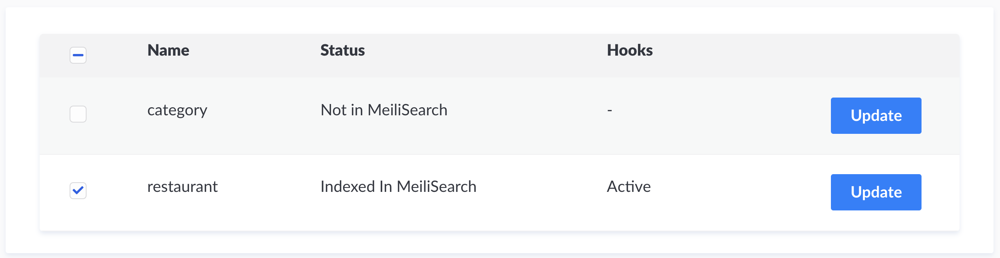

<p align="center">
  
</p>

<h1 align="center">MeiliSearch Strapi Plugin</h1>
<h3 align="center">Forked by <a href="https://github.com/MattieBelt">@MattieBelt</a></h3>

<h4 align="center">
  <a href="https://github.com/meilisearch/MeiliSearch">MeiliSearch</a> |
  <a href="https://docs.meilisearch.com">Documentation</a> |
  <a href="https://slack.meilisearch.com">Slack</a> |
  <a href="https://roadmap.meilisearch.com/tabs/1-under-consideration">Roadmap</a> |
  <a href="https://www.meilisearch.com">Website</a> |
  <a href="https://docs.meilisearch.com/faq">FAQ</a>
</h4>

<p align="center">
  <a href="https://www.npmjs.com/package/strapi-plugin-meilisearch"></a>
  <a href="https://github.com/meilisearch/strapi-plugin-meilisearch/actions"></a>
  <a href="https://github.com/prettier/prettier"></a>
  <a href="https://github.com/meilisearch/strapi-plugin-meilisearch/blob/main/LICENSE"></a>
  <a href="https://app.bors.tech/repositories/32218"></a>
</p>

<p align="center">⚡ The MeiliSearch plugin for Strapi</p>

MeiliSearch is an open-source search engine. [Discover what MeiliSearch is!](https://github.com/meilisearch/meilisearch)

Add your Strapi collections into a MeiliSearch instance. The plugin listens to modifications made on your collections and updates MeiliSearch accordingly.

## Table of Contents <!-- omit in toc -->

- [📖 Documentation](#-documentation)
- [🔧 Installation](#-installation)
- [🎬 Getting Started](#-getting-started)
- [💡 Run the Playground](#-run-the-playground)
- [🤖 Compatibility with MeiliSearch and Strapi](#-compatibility-with-meilisearch-and-strapi)
- [⚙️ Development Workflow and Contributing](#️-development-workflow-and-contributing)
- [🌎 Community support](#-community-support)
- [🤩 Just for the pleasure of the eyes](#-just-for-the-pleasure-of-the-eyes)

## 📖 Documentation

To understand MeiliSearch and how it works, see the [MeiliSearch's documentation](https://docs.meilisearch.com/learn/what_is_meilisearch/).

To understand Strapi and how to create an app, see [Strapi's documentation](https://strapi.io/documentation/developer-docs/latest/getting-started/introduction.html).

## 🔧 Installation

Inside your Strapi app, add the package:

With `npm`:
```bash
npm install strapi-plugin-meilisearch@npm:@mattiebelt/strapi-plugin-meilisearch
```

With `yarn`:
```bash
yarn add strapi-plugin-meilisearch@npm:@mattiebelt/strapi-plugin-meilisearch
```

To apply the plugin to Strapi, a re-build is needed:
```bash
strapi build --clean
```

You will need both a running Strapi app and a running MeiliSearch instance. For [specific version compatibility see this section](#-compatibility-with-meilisearch).

### 🏃‍♀️ Run MeiliSearch <!-- omit in toc -->

There are many easy ways to [download and run a MeiliSearch instance](https://docs.meilisearch.com/reference/features/installation.html#download-and-launch).

For example, if you use Docker:

```bash
docker pull getmeili/meilisearch:latest # Fetch the latest version of MeiliSearch image from Docker Hub
docker run -it --rm -p 7700:7700 getmeili/meilisearch:latest ./meilisearch --master-key=masterKey
```

### 🏃‍♂️ Run Strapi <!-- omit in toc -->

If you don't have a running Strapi project yet, you can either launch the [playground present in this project](#-run-the-playground) or [create a Strapi project](https://strapi.io/documentation/developer-docs/latest/getting-started/quick-start.html).

We recommend adding your collections in development mode to allow the server reloads needed to apply hooks.

```bash
strapi develop
// or
yarn develop
```

## 🎬 Getting Started

Now that you have installed the plugin, a running meiliSearch instance and, a running Strapi app, let's go to the plugin page on your admin dashboard.

On the left-navbar, `MeiliSearch` appears under the `PLUGINS` category. If it does not, ensure that you have installed the plugin and re-build Strapi (see [installation](#-installation)).

### 🤫 Add Credentials <!-- omit in toc -->

First, you need to configure credentials via the strapi config.
Add the following to `config/plugins.js` or `config/[NODE_ENV]/plugin.js` ([docs](https://strapi.io/documentation/developer-docs/latest/setup-deployment-guides/configurations.html#plugins)):

```js
module.exports = () => ({
  //...
  meilisearch: {
    // Your master key
    apiKey: "masterKey",
    // Your meili host
    host: "http://localhost:7700",
    // The collections you want to be indexed
    collections: [
        { name: 'project', index: 'global' }, // `index` is optional
        { name: 'category' },
        { name: 'page', index: 'global' }
      ]
  }
  //...
})
```

Using `config/[NODE_ENV]/plugin.js`, it is possible to have a config file for different environments.

Note that if you use both method, the config file overwrites the credentials added through the plugin page.

### 🪝 Apply Hooks <!-- omit in toc -->

Hooks are listeners that update MeiliSearch each time you add/update/delete an entry in your collections.
To will load on a server (re)start.

<p align="center">

</p>

### 🕵️‍♀️ Start Searching <!-- omit in toc -->

Once you have a collection containing documents indexed in MeiliSearch, you can [start searching](https://docs.meilisearch.com/learn/getting_started/quick_start.html#search).

To search in MeiliSearch, you can use the [instant-meilisearch](https://github.com/meilisearch/instant-meilisearch) library that integrates a whole search interface, or our [meilisearch-js](https://github.com/meilisearch/meilisearch-js) SDK.

#### ⚡️ Using Instant meiliSearch <!-- omit in toc -->

You can have a front up and running in record time with [instant-meilisearch](https://github.com/meilisearch/instant-meilisearch).

<p align="center">

</p>

In Instant MeiliSearch, you only have to provide your credentials and index name (_uid_). `restaurant` is the index name in our example.

You can have a quick preview with the following code in an HTML file. Create an HTML file, copy-paste the code below and open the file in your browser (or find it in `/front_examples/restaurant.html`).

```html
<!DOCTYPE html>
<html lang="en">
  <head>
    <meta charset="utf-8" />
    <link rel="stylesheet" href="https://cdn.jsdelivr.net/npm/@meilisearch/instant-meilisearch/templates/basic_search.css" />
  </head>
  <body>
    <div class="wrapper">
      <div id="searchbox" focus></div>
      <div id="hits"></div>
    </div>
    <script src="https://cdn.jsdelivr.net/npm/@meilisearch/instant-meilisearch/dist/instant-meilisearch.umd.min.js"></script>
    <script src="https://cdn.jsdelivr.net/npm/instantsearch.js@4"></script>
    <script>
        const search = instantsearch({
            indexName: "restaurant",
            searchClient: instantMeiliSearch(
                "http://localhost:7700"
            )
            });

            search.addWidgets([
              instantsearch.widgets.searchBox({
                  container: "#searchbox"
              }),
              instantsearch.widgets.configure({ hitsPerPage: 8 }),
              instantsearch.widgets.hits({
                  container: "#hits",
                  templates: {
                  item: `
                      <div>
                      <div class="hit-name">
                          {{#helpers.highlight}}{ "attribute": "name" }{{/helpers.highlight}}
                      </div>
                      </div>
                  `
                  }
              })
            ]);
            search.start();
    </script>
  </body>
</html>
```

#### 💛 Using MeiliSearch for JS <!-- omit in toc -->

You can also use [meilisearch-js](https://github.com/meilisearch/meilisearch-js) to communicate with MeiliSearch.

The following code is a setup that will output a restaurant after a search.

```javascript
import { MeiliSearch } from 'meilisearch'

;(async () => {
  const client = new MeiliSearch({
    host: 'http://127.0.0.1:7700',
    apiKey: 'masterKey',
  })

  // An index is where the documents are stored.
  const response = client.index('movies').search('Biscoutte')
})()
```

**response content**:
```json
{
  "hits": [
    {
      "id": 3,
      "name": "Biscotte Restaurant",
      "description": "Welcome to Biscotte restaurant! Restaurant Biscotte offers a cuisine based on fresh, quality products, often local, organic when possible, and always produced by passionate producers.",
      "categories": []
    }
  ],
  "offset": 0,
  "limit": 20,
  "nbHits": 1,
  "exhaustiveNbHits": false,
  "processingTimeMs": 1,
  "query": "biscoutte"
}
```

## 💡 Run the Playground

Instead of adding the plugin to an existing project, you can try it out using the playground in this project.

```bash
# Root of repository
yarn playground:dev
```

This command will install the required dependencies and launch the app in development mode. You should be able to reach it on the [port 8000 of your localhost](http://localhost:8000/admin/).

## 🤖 Compatibility with MeiliSearch and Strapi

**Supported Strapi versions**:

Complete installation requirements are the same as for Strapi itself and can be found in the documentation under [installation Requirements](https://strapi.io/documentation/v3.x/installation/cli.html#step-1-make-sure-requirements-are-met).

- Strapi v3.6.x

(This plugin may work with the older Strapi versions, but these are not tested nor officially supported at this time.)

**Supported MeiliSearch versions**:

This package only guarantees the compatibility with the [version v0.20.0 of MeiliSearch](https://github.com/meilisearch/MeiliSearch/releases/tag/v0.20.0).

**Node / NPM versions**:

- NodeJS >= 12.10 <= 14
- NPM >= 6.x

**We recommend always using the latest version of Strapi to start your new projects**.

## ⚙️ Development Workflow and Contributing

Any new contribution is more than welcome in this project!

If you want to know more about the development workflow or want to contribute, please visit our [contributing guidelines](/CONTRIBUTING.md) for detailed instructions!

## 🌎 Community support

- For general help using **MeiliSearch**, please refer to [the official MeiliSearch documentation](https://docs.meilisearch.com).
- Contact the [MeiliSearch support](https://docs.meilisearch.com/learn/what_is_meilisearch/contact.html)
- Strapi [community Slack](https://slack.strapi.io/)
- For general help using **Strapi**, please refer to [the official Strapi documentation](https://strapi.io/documentation/).

## 🤩 Just for the pleasure of the eyes

Using the [foodadvisor](https://github.com/strapi/foodadvisor) restaurant demo Strapi provided. We added a searchbar to it using [instant-meilisearch](https://github.com/meilisearch/instant-meilisearch).

<p align="center">

</p>
