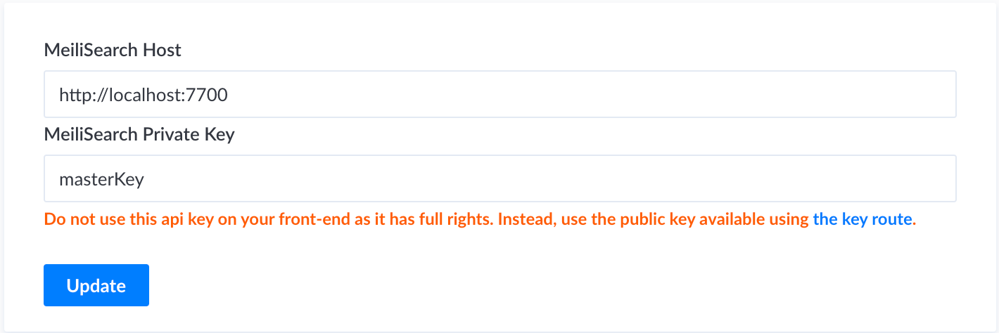
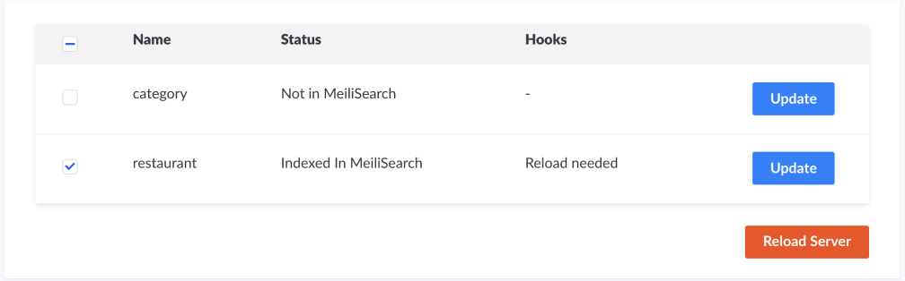

<h1 align="center">MeiliSearch Strapi Plugin</h1>

<p align="center">
  
</p>

<h4 align="center">
  <a href="https://github.com/meilisearch/MeiliSearch">MeiliSearch</a> |
  <a href="https://docs.meilisearch.com">Documentation</a> |
  <a href="https://slack.meilisearch.com">Slack</a> |
  <a href="https://roadmap.meilisearch.com/tabs/1-under-consideration">Roadmap</a> |
  <a href="https://www.meilisearch.com">Website</a> |
  <a href="https://docs.meilisearch.com/faq">FAQ</a>
</h4>

<p align="center">
  <a href="https://www.npmjs.com/package/meilisearch"></a>
  <a href="https://github.com/meilisearch/meilisearch-js/actions"></a>
  <a href="https://github.com/prettier/prettier"></a>
  <a href="https://github.com/meilisearch/meilisearch-js/blob/main/LICENSE"></a>
  <a href="https://app.bors.tech/repositories/28762"></a>
</p>

<p align="center">⚡ The MeiliSearch plugin for Strapi</p>

MeiliSearch is an open-source search engine. [Discover what MeiliSearch is!](https://github.com/meilisearch/meilisearch)

Add your Strapi collections into a MeiliSearch instance. The plugin listens to modifications made on your collections and update MeiliSearch accordingly.

## Table of Contents <!-- omit in toc -->

- [📖 Documentation](#-documentation)
- [🔧 Installation](#-installation)
- [🎬 Getting Started](#-getting-started)
- [🤖 Compatibility with MeiliSearch and Strapi](#-compatibility-with-meilisearch)
- [💡 Learn More](#-learn-more)
- [⚙️ Development Workflow and Contributing](#️-development-workflow-and-contributing)
- [🌎 Community support](#️-community-support)

## 📖 Documentation

To understand MeiliSearch and how it works, see the [Documentation](https://docs.meilisearch.com/learn/what_is_meilisearch/).
To understand Strapi and how to create an app, see the [Documentation](https://strapi.io/documentation/developer-docs/latest/getting-started/introduction.html).

## 🔧 Installation

Inside your Strapi app, add the package:

With `npm`:
```bash
npm install strapi-plugin-meilisearch
```

With `yarn`:
```bash
npm install strapi-plugin-meilisearch
```

To apply the plugin to Strapi, a re-build is needed:
```bash
strapi build
```

You will need both a running Strapi app and a running MeiliSearch instance. For [specific version compatibiliy see this section](#-compatibility-with-meilisearch).

### 🏃‍♀️ Run MeiliSearch

There are many easy ways to [download and run a MeiliSearch instance](https://docs.meilisearch.com/reference/features/installation.html#download-and-launch).

Instead of adding the plugin to an existing project, you can try it out using the playground.

```bash
# with yarn
yarn develop
```

### 🏃‍♂️ Run Strapi

If you don't have a running Strapi project yet, you can either launch the [playground present in this project](#playground) or [create a Strapi Project](#create-strapi-project).


It is recommended to add your collections in developement mode as it allows the server reloads, needed to apply hooks.

```bash
strapi develop
```

## 🎬 Getting Started

Now that you have installed the plugin, a running meiliSearch instance and, a running Strapi app, lets go the plugin page on your admin dashboard.

On the left-navbar `MeiliSearch` appears under the `PLUGINS` category. If it does not, ensure that you have installed the plugin and re-build Strapi (see [installation](#-installation)).

### 🤫 Add Credentials

First, add your MeiliSearch credentials in the upper box of the MeiliSearch plugin page.

For example, using the credentials used in the [above section](#-run-meilisearch) it looks like this:


<p align="center">

</p>

Once completed, click on the `add` button.


### 🚛 Add your collections to MeiliSearch

If you don't have any collection yet in your Strapi Plugin, please follow [Strapi quickstart](https://strapi.io/documentation/developer-docs/latest/getting-started/quick-start.html).

We will use, as **example**, the collections provided by Strapi's quickstart.

On your plugin homepage you should have two collections appearing: `restaurant` and `category`.

<p align="center">

</p>

By clicking on the left checkbox, the collection will be automatically indexed in MeiliSearch. For example, if you click on the `restaurant` checkbox, all your restaurants are now available in MeiliSearch.

You can check it using

### 🪝 Apply Hooks

Hooks are listeners that update MeiliSearch each time you add/update/delete an entry in your collections.
In order to activate them you will have to reload the server. This is possible by clicking on the `Reload Server` button if you are in auto-reload mode, or by manually reloading the server mode.


<p align="center">

</p>


### 🕵️‍♀️ Start Searching

Once you have a collection containing documents indexed in MeiliSearch, you can [start searching](https://docs.meilisearch.com/learn/getting_started/quick_start.html#search).

Using the above credentials the following code shows how to search on one of your collections:

To search in MeiliSearch, you can use the [instant-meilisearch](https://github.com/meilisearch/instant-meilisearch) SDK that integrates a whole search interface, or our library [meilisearch-js](https://github.com/meilisearch/meilisearch-js).

#### ⚡️ Using Instant meiliSearch


In Instant MeiliSearch you only have to provide your credentials and your index name (`restaurant` is the index name in our example).

You can have a quick preview the following code in a HTML file
```html
<!DOCTYPE html>
<html lang="en">
  <head>
    <meta charset="utf-8" />
    <link rel="stylesheet" href="https://cdn.jsdelivr.net/npm/@meilisearch/instant-meilisearch/templates/basic_search.css" />
  </head>
  <body>
    <div class="wrapper">
      <div id="searchbox" focus></div>
      <div id="hits"></div>
    </div>
    <script src="https://cdn.jsdelivr.net/npm/@meilisearch/instant-meilisearch/dist/instant-meilisearch.umd.min.js"></script>
    <script src="https://cdn.jsdelivr.net/npm/instantsearch.js@4"></script>
    <script>
        const search = instantsearch({
            indexName: "movies",
            searchClient: instantMeiliSearch(
                "http://localhost:7700"
            )
            });

            search.addWidgets([
              instantsearch.widgets.searchBox({
                  container: "#searchbox"
              }),
              instantsearch.widgets.configure({ hitsPerPage: 8 }),
              instantsearch.widgets.hits({
                  container: "#hits",
                  templates: {
                  item: `
                      <div>
                      <div class="hit-name">
                          {{#helpers.highlight}}{ "attribute": "title" }{{/helpers.highlight}}
                      </div>
                      </div>
                  `
                  }
              })
            ]);
            search.start();
    </script>
  </body>
</html>
```


```javascript
import { MeiliSearch } from 'meilisearch'

;(async () => {
  const client = new MeiliSearch({
    host: 'http://127.0.0.1:7700',
    apiKey: 'masterKey',
  })

  // An index is where the documents are stored.
  const response = client.index('movies').search('biscoute')
})()
```

**response content**:
```json
{
  "hits": [
    {
      "id": 3,
      "name": "Biscotte Restaurant",
      "description": "Welcome to Biscotte restaurant! Restaurant Biscotte offers a cuisine based on fresh, quality products, often local, organic when possible, and always produced by passionate producers.",
      "categories": []
    }
  ],
  "offset": 0,
  "limit": 20,
  "nbHits": 1,
  "exhaustiveNbHits": false,
  "processingTimeMs": 1,
  "query": "biscoutte"
}
```

## 💡 Learn More

If you don't have a running Strapi app, you can still try this plugin using either of one of the following options:

### Run Playground

Instead of adding the plugin to an existing project, you can try it out using the playground in this project.

```bash
# with npm
cd playground
npm install
npm run develop
```

Install Strapi with this **Quickstart** command to create a Strapi project instantly:

#### Create strapi project

- Use **yarn** to install the Strapi project (recommended). [Install yarn with these docs](https://yarnpkg.com/lang/en/docs/install/).)

```bash
# with yarn
yarn create strapi-app my-project --quickstart

# with npm/npx
npx create-strapi-app my-project --quickstart
```

_This command generates a brand new project with the default features (authentication, permissions, content management, content type builder & file upload). The **Quickstart** command installs Strapi using a **SQLite** database which is used for prototyping in development._

Once your Strapi project has been created, to link the plugin to this project you have to create a symbolic link inside a plugin folder at the root of the Strapi project.

1. Create plugin folder

```bash
mkdir plugins
```
2. Create symbolic link

```bash
cd plugins
ln -s [PATH_TO_PLUGIN] meilisearch
```
3. Build
```bash
yarn build
```
4. Develop

```bash
yarn develop
```

You can now use the plugin on your Strapi project.


## 🤖 Compatibility with MeiliSearch and Strapi

Complete installation requirements are exact same as for Strapi itself and can be found in the documentation under [Installation Requirements](https://strapi.io/documentation/v3.x/installation/cli.html#step-1-make-sure-requirements-are-met).

**Supported Strapi versions**:

- Strapi v3.4.x

(This plugin may work with the older Strapi versions, but these are not tested nor officially supported at this time.)

**Node / NPM versions**:

- NodeJS >= 12.10 <= 14
- NPM >= 6.x

**We recommend always using the latest version of Strapi to start your new projects**.


## ⚙️ Development Workflow and Contributing

Any new contribution is more than welcome in this project!

If you want to know more about the development workflow or want to contribute, please visit our [contributing guidelines](/CONTRIBUTING.md) for detailed instructions!

## 🌎 Community support

- For general help using Strapi, please refer to [the official Strapi documentation](https://strapi.io/documentation/).
- Strapi Slack [channel](https://slack.strapi.io/)
