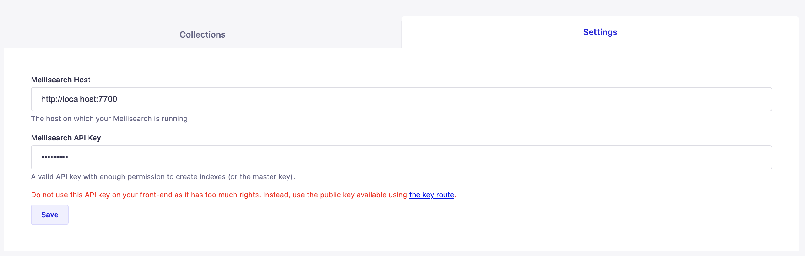
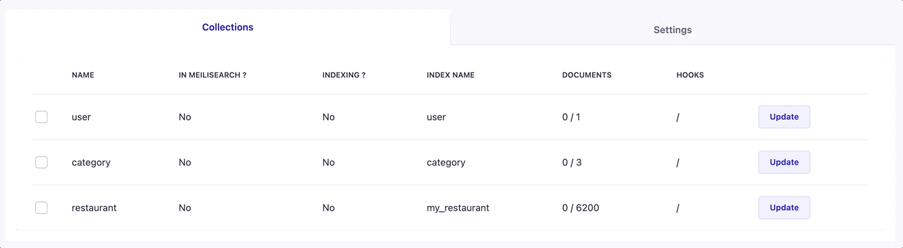
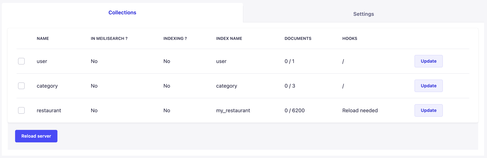
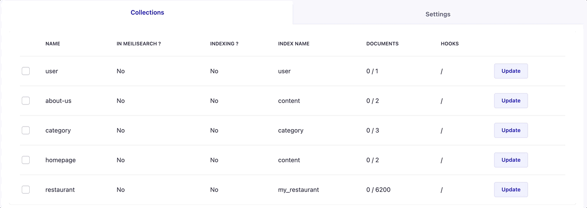

<p align="center">
  
</p>

<h1 align="center">Meilisearch Strapi Plugin</h1>

<h4 align="center">
  <a href="https://github.com/meilisearch/meilisearch">Meilisearch</a> |
  <a href="https://docs.meilisearch.com">Documentation</a> |
  <a href="https://slack.meilisearch.com">Slack</a> |
  <a href="https://roadmap.meilisearch.com/tabs/1-under-consideration">Roadmap</a> |
  <a href="https://www.meilisearch.com">Website</a> |
  <a href="https://docs.meilisearch.com/faq">FAQ</a>
</h4>

<p align="center">
  <a href="https://www.npmjs.com/package/strapi-plugin-meilisearch"></a>
  <a href="https://github.com/meilisearch/strapi-plugin-meilisearch/actions"></a>
  <a href="https://github.com/prettier/prettier"></a>
  <a href="https://github.com/meilisearch/strapi-plugin-meilisearch/blob/main/LICENSE"></a>
  <a href="https://ms-bors.herokuapp.com/repositories/7"></a>
</p>

<p align="center">⚡ The Meilisearch plugin for Strapi</p>

Meilisearch is an open-source search engine. [Discover what Meilisearch is!](https://github.com/meilisearch/meilisearch)

Add your Strapi content-types into a Meilisearch instance. The plugin listens to modifications made on your content-types and updates Meilisearch accordingly.

## Table of Contents <!-- omit in toc -->

- [📖 Documentation](#-documentation)
- [🔧 Installation](#-installation)
- [🎬 Getting Started](#-getting-started)
- [💅 Customization](#-customization)
- [💡 Run the Playground](#-run-the-playground)
- [🤖 Compatibility with Meilisearch and Strapi](#-compatibility-with-meilisearch-and-strapi)
- [⚙️ Development Workflow and Contributing](#️-development-workflow-and-contributing)
- [🌎 Community support](#-community-support)
- [🤩 Just for the pleasure of the eyes](#-just-for-the-pleasure-of-the-eyes)

## 📖 Documentation

To understand Meilisearch and how it works, see the [Meilisearch's documentation](https://docs.meilisearch.com/learn/getting_started/quick_start.html).

To understand Strapi and how to create an app, see [Strapi's documentation](https://strapi.io/documentation/developer-docs/latest/getting-started/introduction.html).

## 🔧 Installation

This package version works with the [v4 of Strapi](https://docs.strapi.io/developer-docs/latest/getting-started/introduction.html). If you are using [Strapi v3](https://docs-v3.strapi.io/developer-docs/latest/getting-started/introduction.html), please refer to [this README](https://github.com/meilisearch/strapi-plugin-meilisearch/tree/v3_main).

Inside your Strapi app, add the package:

With `npm`:
```bash
npm install strapi-plugin-meilisearch
```

With `yarn`:
```bash
yarn add strapi-plugin-meilisearch
```

To apply the plugin to Strapi, a re-build is needed:
```bash
strapi build
```


You will need both a running Strapi app and a running Meilisearch instance. For [specific version compatibility see this section](#-compatibility-with-meilisearch-and-strapi).

### 🏃‍♀️ Run Meilisearch <!-- omit in toc -->

There are many easy ways to [download and run a Meilisearch instance](https://docs.meilisearch.com/reference/features/installation.html#download-and-launch).

For example, if you use Docker:

```bash
docker pull getmeili/meilisearch:latest # Fetch the latest version of Meilisearch image from Docker Hub
docker run -it --rm -p 7700:7700 getmeili/meilisearch:latest meilisearch --master-key=masterKey
```

### 🏃‍♂️ Run Strapi <!-- omit in toc -->

If you don't have a running Strapi project yet, you can either launch the [playground present in this project](#-run-the-playground) or [create a Strapi project](https://strapi.io/documentation/developer-docs/latest/getting-started/quick-start.html).

We recommend indexing your content-types to Meilisearch in development mode to allow the server reloads needed to apply or remove listeners.

```bash
strapi develop
// or
yarn develop
```

### Run Both with Docker

To run Meilisearch and Strapi on the same server you can use Docker. A Docker configuration example can be found in the directory [`resources/docker`](resources/docker/) of this repository.

To run the Docker script add both files `Dockerfile` and `docker-compose.yaml` at the root of your Strapi project and run it with the following command: `docker-compose up`.

## 🎬 Getting Started

Now that you have installed the plugin, a running meiliSearch instance and, a running Strapi app, let's go to the plugin page on your admin dashboard.

On the left-navbar, `Meilisearch` appears under the `PLUGINS` category. If it does not, ensure that you have installed the plugin and re-build Strapi (see [installation](#-installation)).

### 🤫 Add Credentials <!-- omit in toc -->

First, you need to configure credentials via the Strapi config, or on the plugin page.
The credentials are composed of:
- The `host`: The url to your running Meilisearch instance.
- The `api_key`: The `master` or `private` key as the plugin requires administration permission on Meilisearch.[More about permissions here](https://docs.meilisearch.com/reference/features/authentication.html).

⚠️ The `master` or `private` key should never be used to `search` on your front end. For searching, use the `public` key available on [the `key` route](https://docs.meilisearch.com/reference/api/keys.html#get-keys).

#### Using the plugin page

You can add your Meilisearch credentials in the `settings` tab on the Meilisearch plugin page.

For example, using the credentials from the section above: [`Run Meilisearch`](#-run-meilisearch), the following screen shows where the information should be.

<p align="center">

</p>

Once completed, click on the `add` button.

#### Using a config file

To use the Strapi config add the following to `config/plugins.js`:

```js
// config/plugins.js

module.exports = () => ({
  //...
  meilisearch: {
    config: {
      // Your meili host
      host: "http://localhost:7700",
      // Your master key or private key
      apiKey: "masterKey",
    }
  }
})
```

Note that if you use both methods, the config file overwrites the credentials added through the plugin page.


### 🚛 Add your content-types to Meilisearch <!-- omit in toc -->

If you don't have any content-types yet in your Strapi Plugin, please follow [Strapi quickstart](https://strapi.io/documentation/developer-docs/latest/getting-started/quick-start.html).

We will use, as **example**, the content-types provided by Strapi's quickstart (plus the user content-type).

On your plugin homepage, you should have two content-types appearing: `restaurant`, `category` and `user`.

<p align="center">

</p>

By clicking on the left checkbox, the content-type is automatically indexed in Meilisearch. For example, if you click on the `restaurant` checkbox, the indexing to Meilisearch starts.


<p align="center">

</p>

Once the indexing is done, your restaurants are in Meilisearch. We will see in [start searching](#-start-searching) how to try it out.

### 🪝 Apply Hooks <!-- omit in toc -->

Hooks are listeners that update Meilisearch each time you add/update/delete an entry in your content-types.
They are activated as soon as you add a content-type to Meilisearch. For example by clicking on the checkbox of `restaurant`.

Nonetheless, if you **remove a content-type** from Meilisearch by unchecking the checkbox, you need to reload the server. If you don't, actions are still listened to and applied to Meilisearch.
The reload is only possible in develop mode; click on the `Reload Server` button. If not, reload the server manually!

<p align="center">

</p>


## 💅 Customization

It is possible to add settings for every collection. Start by creating a sub-object with the name of the collection inside your `plugin.json` file.

```js
// config/plugins.js

module.exports = () => ({
  //...
  meilisearch: {
    restaurant: {}
  }
})
```

Settings:
- [🏷 Custom index name](#-custom-index-name)
- [🪄 Transform entries](#-transform-entries)
- [🤚 Filter entries](#-filter-entries)
- [🏗 Add Meilisearch settings](#-add-meilisearch-settings)
- [🔎 Entries query](#🔎-entries-query)

### 🏷 Custom index name

By default, when indexing a content-type in Meilisearch, the index in Meilisearch has the same name as the content-type. This behavior can be changed by setting the `indexName` property in the configuration file of the plugin.

**Example:**

In the following example, the `restaurant` content-type in Meilisearch is called `my_restaurant` instead of the default `restaurant`.

```js
// config/plugins.js

module.exports = () => ({
  //...
  meilisearch: {
    config: {
      restaurant: {
        indexName: "my_restaurants",
      }
    }
  }
})
```

It is possible to bind multiple content-types to the same index. They all have to share the same `indexName`.

For example if `shoes` and `shirts` should be bound to the same index, they must have the same `indexName` in the plugin configuration:

```js
// config/plugins.js

module.exports = () => ({
  //...
  meilisearch: {
    config: {
      shirts: {
        indexName: 'products',
      },
      shoes: {
        indexName: 'products',
      },
    },
  },
})
```

Now, on each entry addition from both `shoes` and `shirts` the entry is added in the `product` index of Meilisearch.


**disclaimer**

Nonetheless, it is not possible to know how many entries from each content-type is added to Meilisearch.

For example, given two content-types:
- `Shoes`: with 300 entries and an `indexName` set to `product`
- `Shirts`: 200 entries and an `indexName` set to `product`

The index `product` has both the entries of shoes and shirts. If the index `product` has `350` documents in Meilisearch, it is not possible to know how many of them are from `shoes` or `shirts`.

When removing `shoes` or `shirts` from Meilisearch, both are removed as it would require to much processing to only remove one. You can still re-index only one after that.

<p align="center">Example with two single types:</p>
<p align="center">

</p>

Examples can be found [this directory](./resources/custom-index-name).

### 🪄 Transform entries

By default, the plugin sent the data the way it is stored in your Strapi content-type. It is possible to remove or transform fields before sending your entries to Meilisearch.

Create the alteration function `transformEntry` in the plugin's configuration file. Before sending the data to Meilisearch, every entry passes through this function where the alteration is applied.

`transformEntry` can be `synchronous` or `asynchronous`.

You can find a lot of examples in [this directory](./resources/entries-transformers).

**Example**

For example, the `restaurant` content-type has a relation with the `category` content-type. Inside a `restaurant` entry the `categories` field contains an array of each category in an `object` format: `[{ name: "Brunch" ...}, { name: "Italian ... }]`.

The following transforms `categories` in an array of strings containing only the name of the category:

```js
// config/plugins.js

module.exports = {
  meilisearch: {
    config: {
      restaurant: {
        transformEntry({ entry }) { // can also be async
          return {
            ...entry,
            categories: entry.categories.map(category => category.name)
          }
        },
      }
    }
  },
}
```

Result:
```json
  {
    "id": 2,
    "name": "Squared Pizza",
    "categories": [
      "Brunch",
      "Italian"
    ],
    // other fields
  }
```

By transforming the `categories` into an array of names, it is now compatible with the [`filtering` feature](https://docs.meilisearch.com/reference/features/filtering_and_faceted_search.html#configuring-filters) in Meilisearch.

**Important**: You should always return the id of the entry without any transformation to [allow sync](https://github.com/meilisearch/strapi-plugin-meilisearch/issues/487) when unpublished or deleting some entries in Strapi.

### 🤚 Filter entries

You might want to filter out some entries. This is possible with the `filterEntry`. Imagine you don't like `Alfredo's` restaurant. You can filter out this specific entry.

`filterEntry` can be `synchronous` or `asynchronous`.

```js
// config/plugins.js

module.exports = {
  meilisearch: {
    config: {
      restaurant: {
        filterEntry({ entry }) { // can also be async
          return entry.title !== `Alfredo`
        },
      },
    },
  },
}
```

`Alfredo's` restaurant is not added to Meilisearch.

### 🏗 Add Meilisearch settings

Each index in Meilisearch can be customized with specific settings. It is possible to add your [Meilisearch settings](https://docs.meilisearch.com/reference/features/settings.html#settings) configuration to the indexes you create using the `settings` field in the plugin configuration file.

The settings are added when either: adding a content-type to Meilisearch or when updating a content-type in Meilisearch. The settings are not updated when documents are added through the [`listeners`](-apply-hooks).

**For example**
```js
module.exports = {
  meilisearch: {
    config: {
      restaurant: {
        settings: {
          filterableAttributes: ['categories'],
          synonyms: {
            healthy: ['pokeball', 'vegan']
          }
        }
      }
    }
  },
}
```

[See resources](./resources/meilisearch-settings) for more settings examples.

### 🔎 Entries query

When indexing a content type to Meilisearch, the plugin has to fetch the documents from your database. With `entriesQuery` it is possible to specify some options that should be applied during the fetching of the entries.
The options you can set are described in the [`findMany` documentation](https://docs.strapi.io/developer-docs/latest/developer-resources/database-apis-reference/entity-service/crud.html#findmany) of Strapi. However, we do not accept any changes on the `start` parameter.

If you are using the [🌍 Internationalization (i18n)](https://docs.strapi.io/developer-docs/latest/plugins/i18n.html) plugin, an additional field `locale` can also be added in `entriesQuery`.

**For example**

For example, if you want your documents to be fetched in batches of `1000` you specify it in the `entriesQuery` option.

```js
module.exports = {
  meilisearch: {
    config: {
      restaurant: {
        entriesQuery: {
          limit: 1000
        }
      }
    }
  },
}
```

[See resources](./resources/entries-query) for more entriesQuery examples.


### 🕵️‍♀️ Start Searching <!-- omit in toc -->

Once you have a content-type indexed in Meilisearch, you can [start searching](https://docs.meilisearch.com/learn/getting_started/quick_start.html#search).

To search in Meilisearch, you can use the [instant-meilisearch](https://github.com/meilisearch/instant-meilisearch) library that integrates a whole search interface, or our [meilisearch-js](https://github.com/meilisearch/meilisearch-js) SDK.

#### ⚡️ Using Instant meiliSearch <!-- omit in toc -->

You can have a front up and running in record time with [instant-meilisearch](https://github.com/meilisearch/instant-meilisearch).

<p align="center">

</p>

In Instant Meilisearch, you only have to provide your credentials and index name (_uid_). `restaurant` is the index name in our example.

You can have a quick preview with the following code in an HTML file. Create an HTML file, copy-paste the code below and open the file in your browser (or find it in `/front_examples/restaurant.html`).

```html
<!DOCTYPE html>
<html lang="en">
  <head>
    <meta charset="utf-8" />
    <link rel="stylesheet" href="https://cdn.jsdelivr.net/npm/@meilisearch/instant-meilisearch/templates/basic_search.css" />
  </head>
  <body>
    <div class="wrapper">
      <div id="searchbox" focus></div>
      <div id="hits"></div>
    </div>
    <script src="https://cdn.jsdelivr.net/npm/@meilisearch/instant-meilisearch/dist/instant-meilisearch.umd.min.js"></script>
    <script src="https://cdn.jsdelivr.net/npm/instantsearch.js@4"></script>
    <script>
        const search = instantsearch({
            indexName: "restaurant",
            searchClient: instantMeiliSearch(
                "http://localhost:7700",
                'publicKey', // Use the public key not the private or master key to search.
            )
            });

            search.addWidgets([
              instantsearch.widgets.searchBox({
                  container: "#searchbox"
              }),
              instantsearch.widgets.configure({ hitsPerPage: 8 }),
              instantsearch.widgets.hits({
                  container: "#hits",
                  templates: {
                  item: `
                      <div>
                      <div class="hit-name">
                          {{#helpers.highlight}}{ "attribute": "name" }{{/helpers.highlight}}
                      </div>
                      </div>
                  `
                  }
              })
            ]);
            search.start();
    </script>
  </body>
</html>
```

#### 💛 Using Meilisearch for JS <!-- omit in toc -->

You can also use [meilisearch-js](https://github.com/meilisearch/meilisearch-js) to communicate with Meilisearch.

The following code is a setup that will output a restaurant after a search.

```javascript
import { MeiliSearch } from 'meilisearch'

;(async () => {
  const client = new MeiliSearch({
    host: 'http://127.0.0.1:7700',
    apiKey: 'publicKey', // Use the public key not the private or master key to search.
  })

  // An index is where the documents are stored.
  const response = client.index('movies').search('Biscoutte')
})()
```

**response content**:
```json
{
  "hits": [
    {
      "id": 3,
      "name": "Biscotte Restaurant",
      "description": "Welcome to Biscotte restaurant! Restaurant Biscotte offers a cuisine based on fresh, quality products, often local, organic when possible, and always produced by passionate producers.",
      "categories": []
    }
  ],
  "offset": 0,
  "limit": 20,
  "nbHits": 1,
  "exhaustiveNbHits": false,
  "processingTimeMs": 1,
  "query": "biscoutte"
}
```

## 💡 Run the Playground

Instead of adding the plugin to an existing project, you can try it out using the playground in this project.

```bash
# Root of repository
yarn playground:build # Build the playground
yarn playground:dev # Start the development server
```

This command will install the required dependencies and launch the app in development mode. You should be able to reach it on the [port 8000 of your localhost](http://localhost:8000/admin/).

## 🤖 Compatibility with Meilisearch and Strapi

**Supported Strapi versions**:

Complete installation requirements are the same as for Strapi itself and can be found in the documentation under [installation Requirements](https://strapi.io/documentation/v3.x/installation/cli.html#step-1-make-sure-requirements-are-met).

- Strapi `>=v4.x.x`

If you are using [Strapi v3](https://github.com/strapi/strapi/tree/v3.6.9), please refer to [this README](https://github.com/meilisearch/strapi-plugin-meilisearch/tree/v0.5.1).

**Supported Meilisearch versions**:

This package only guarantees the compatibility with the [version v0.29.0 of Meilisearch](https://github.com/meilisearch/meilisearch/releases/tag/v0.29.0).

**Node / NPM versions**:

- NodeJS >= 14.10 <= 16
- NPM >= 6.x

**We recommend always using the latest version of Strapi to start your new projects**.

## ⚙️ Development Workflow and Contributing

Any new contribution is more than welcome in this project!

If you want to know more about the development workflow or want to contribute, please visit our [contributing guidelines](/CONTRIBUTING.md) for detailed instructions!

## 🌎 Community support

- For general help using **Meilisearch**, please refer to [the official Meilisearch documentation](https://docs.meilisearch.com).
- Contact the [Meilisearch support](https://docs.meilisearch.com/learn/what_is_meilisearch/contact.html)
- Strapi [community Slack](https://slack.strapi.io/)
- For general help using **Strapi**, please refer to [the official Strapi documentation](https://strapi.io/documentation/).

## 🤩 Just for the pleasure of the eyes

Using the [foodadvisor](https://github.com/strapi/foodadvisor) restaurant demo Strapi provided. We added a searchbar to it using [instant-meilisearch](https://github.com/meilisearch/instant-meilisearch).

<p align="center">

</p>
